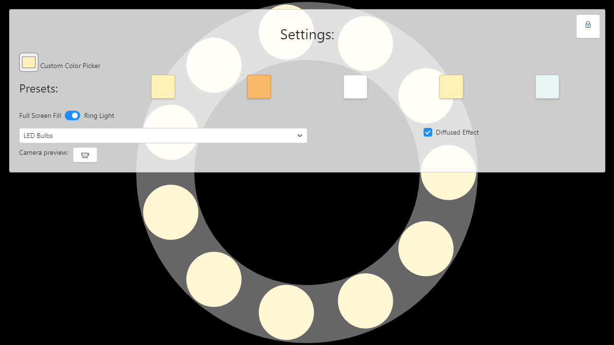

## Light Screen Display
> Simple webpage that fills your screen with an emulated LED ring-light, solid ring light, or solid fill. Use preset colors, or pick your own!

## Use It

🚀 -> [displaylight.netlify.app](https://displaylight.netlify.app/)

## Screenshots

## Why?
I made this for fun, because I sometimes have some spare screen real-estate when attending video conferencing events, and was wondering if something like this could actually make a difference. It actually does help a little! However, it definitely is no replacement for a real dedicated fill light / ring light / lamp.

## Features
- Modes
	- Ring Light
		- LEDs
		- Diffused LEDs
		- Solid Ring
	- Solid Full-Screen Fill
- Camera preview
- Auto-hiding settings panel (can be disabled)
- Keeps screen on while in use
- Custom color picker, or use presets
- And more to come?
## Creator
More About Me (Joshua Tzucker):

- Website 🔗: <a href="https://joshuatz.com/" rel="noopener" target="_blank">joshuatz.com</a>
- Twitter 💬: <a href="https://twitter.com/1joshuatz" rel="noopener" target="_blank">@1joshuatz</a>
- Github 💾: <a href="https://github.com/joshuatz" rel="noopener" target="_blank">github.com/joshuatz</a>

## Attribution
- [Favicon](https://www.iconfinder.com/icons/3045432/desktop_hotel_lamp_light_office_icon)
- [Lock Icons](https://www.iconfinder.com/iconsets/evil-icons-user-interface)